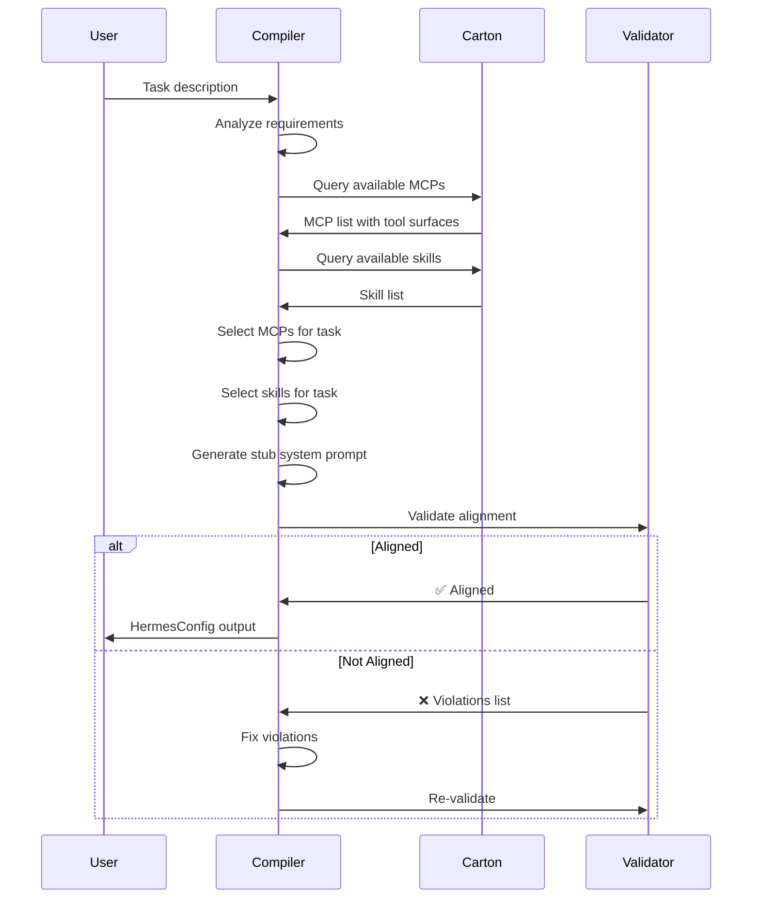

# DESIGN.md — Compoctopus: Self-Compiling Agent Compiler Pipeline

> Single Canonical Design Document
> Status: ASPIRATIONAL (validated against working code patterns)
> Location: Built at `scratch/compoctopus`, deployed to `mind_of_god` via SDNA+Heaven
> Contains all evolutions of DESIGN.md in one complete perfect record

### Companion Documents

| Doc | Contents |
|-----|----------|
| [01_evolution_system_analysis.md](docs/01_evolution_system_analysis.md) | Deep analysis of the legacy Evolution System — the proto-Compoctopus. Call stack, 5 geometric alignments, why it works/fails, lessons learned. |
| [02_theoretical_foundations.md](docs/02_theoretical_foundations.md) | D:D→D endomorphism, 5 geometric invariants (formal), obstruction-driven constraint geometry (Ш-states, catastrophe, L operator, thermodynamic stability), SCSPL tower (Acolyte → Disciple → Image → GOD), bandit problem. |
| [03_genealogy.md](docs/03_genealogy.md) | Lineage of every component: Evolution System, Progenitor, PIS, Acolyte, Super Orchestrator, Prompt Blocks, Sophia-MCP. Source code locations, status, what maps to which Compoctopus phase. |

### Implementation

| File | Contents |
|------|----------|
| [compoctopus/base.py](compoctopus/base.py) | Abstract base classes — `CompilerArm`, `GeometricAlignment`, `MermaidSpec`, `SystemPromptSection`, `ToolSurface`, `CompilationPhase`, `CompilerPipeline` |

---

## L0: Vision

The Compoctopus is a **compiler-compiler** that produces geometrically aligned agent systems. Given a domain description, it outputs agents whose system prompts, input prompts, tool surfaces, skills, MCPs, and state machines are **co-compiled** — every component references exactly what exists, nothing is orphaned, nothing is hallucinated.

The pipeline is a fixed-point endomorphism **D:D→D**. The compiler can compile itself. The agents it produces can produce more agents through the same pipeline.

**The practical outcome**: no more agents with missing tools, no more prompts that reference nonexistent capabilities, no more mysterious MiniMax 2013 errors, no more compound garbage.

---

## L1: Architecture

### The Abstract Base (ES Syntax)

Every compiler arm produces outputs that satisfy **5 geometric invariants**:

| # | Invariant | What it means |
|---|-----------|---------------|
| 1 | **Dual Description** | System prompt (prose) and input prompt (mermaid/spec) describe the same program from orthogonal angles |
| 2 | **Capability Surface** | Every tool/MCP referenced in prompts exists in the agent's tool surface; every tool has a prompt reference |
| 3 | **Trust Boundary** | Agent scope matches container/permission scope — can't do more than allowed |
| 4 | **Phase ↔ Template** | State machine phase determines prompt template; classification of output determines next phase |
| 5 | **Polymorphic Dispatch** | Feature type determines compilation path — same base, different output shapes |

### The Compiler Hierarchy

**Base compilers (the arms)** — each produces one facet of an agent:

```
┌───────────────────────────────────────────────────┐
│              Base Compilers (Arms)                 │
│                                                   │
│  System Prompt   ← incl. mermaid (MermaidMaker)   │
│  Input Prompt    ← incl. prompt crafting           │
│  Agent Config    ← HermesConfig / HeavenAgentConfig│
│  Skill           ← skill file generation           │
│  OnionMorph      ← routing logic                   │
│                                                   │
│  ASPIRATIONAL: Explorer                           │
│    Scout agent (BashTool + Carton, READ-ONLY)     │
│    Traces callgraphs, isolates logic regions,     │
│    produces context bundles for downstream arms.  │
│    Runs BEFORE coder. Passes context via Dovetail.│
│    NOT deterministic — uses LLM to understand     │
│    which code is relevant to the task.            │
│                                                   │
│  Each arm uses workers internally:                │
│    OctoCoder (write code)                         │
│    MermaidMaker (write mermaids)                  │
│    ... more TBD                                   │
├───────────────────────────────────────────────────┤
│            Abstract ES Syntax Base                 │
│    (mermaid + XML sections + SM + tool surface)    │
└───────────────────────────────────────────────────┘
```

**Higher-order compilers:**

```
CompoctopusCompiler              ← makes SPECIALIZED Compoctopus instances
  └── CompoctopusAgentCompilerPipeline × N   ← makes COMPLETE agents
        ├── System Prompt Compiler
        ├── Input Prompt Compiler
        ├── Agent Config Compiler
        ├── Skill Compiler
        └── OnionMorph Router Compiler
```

- **CompoctopusAgentCompilerPipeline**: chains every base compiler in sequence
  to produce a complete, geometrically aligned agent.
- **CompoctopusCompiler**: calls a list of AgentCompilerPipelines to produce
  a specialized version of Compoctopus itself. THIS is the D:D→D endomorphism.

**Bandit selection**: prefers the highest compilation order already achieved.
If a CompoctopusAgentCompilerPipeline exists, Bandit uses that (full agent)
over individual base compilers. Search goes top-down.

### The Cycle

```
Chains → Agents → MCPs → Skills → System Prompts → Input Prompts → Chains
  ↑                                                                   │
  └───────────────────────────────────────────────────────────────────┘
```

### The Self-Compilation Bootstrap (D:D→D Fixed Point)

Compoctopus compiles its own head. Each step makes the head smarter,
which makes the next compilation better, until convergence.

```
Step 0: Generic OctoHead
        (basic system prompt, CreatePRD tool, no specialized identity)
        │
        ↓ write PRD for "Prompt Engineer agent", run through pipeline
        │
Step 1: PE agent (compiled by the system)
        Put PE in OctoHead → OctoHead now has PE identity
        │
        ↓ PE-powered OctoHead writes PRD for "OctoHead Specialist"
        │
Step 2: OctoHead Specialist (compiled by the PE-powered system)
        Put Specialist in OctoHead → OctoHead has its own compiled identity
        │
        ↓ converged
        │
Step 3: DONE. The system compiled its own interface.
        The OctoHead Specialist IS the fixed point because
        it was built by the system it's the head of.
```

**Why this works:**
- Step 0 bootstraps with a generic prompt — good enough to write a PRD
- Step 1 produces a PE that's better at writing PRDs than the generic prompt
- Step 2 produces a specialist that's better at *being the head* than a generic PE
- The system eats itself into existence

**What you need to run this:**
- OctoHead config wrapper ✅ (`make_octohead`)
- CreatePRD tool ✅ (`make_heaven_tool_from_docstring`)
- Planner → Bandit → OctoCoder pipeline ✅
- PRD for "build a PE agent" — Step 1 input
- PRD for "build an OctoHead specialist" — Step 2 input

### The Full Flow

#### File Lifecycle

| Extension | Name | Stage |
|-----------|------|-------|
| `.🪸` | Coral | PRD file. Created by OctoHead, refined with user, sent to build daemon. |
| `.🐙` | Octopus | File being compiled by the pipeline. |
| `.🏄` | Surf | Results report. Pipeline output when build is complete. |
| `.🤖` | Robot | Auto-dev trigger flag. Singleton — one at a time, gated by PR acceptance. |

#### OctoHead Phases

1. **Talk about system/design** — discuss the idea, clarify requirements
2. **Conceptualize PRD** — draft `.🪸` file via CreatePRD
3. **Refine PRD** — iterate with user until ready
4. **Queue PRD** — BuildPRD moves `.🪸` to build daemon queue
5. **Talk/Review** — loop back or review `.🏄` results
6. **Go Auto** (optional) — GoAuto writes `.🤖` flag → auto daemon runs one self-improvement cycle

#### Two Containers (docker-compose)

| Container | Role | Processes |
|-----------|------|-----------|
| **brain** | User-facing. Interactive OctoHead CLI. | `run_octohead.py` |
| **sandbox** | Disposable. Runs both daemons. | `daemon.py` (build) + `auto_daemon.py` (auto) |

Shared volume bridges the two: `.🪸` and `.🤖` files flow from brain → sandbox.

#### Manual Flow (user tells it what to build)

```
User ↔ OctoHead (brain container)
         ↓ CreatePRD → writes .🪸 to shared volume
         ↓ (user refines PRD through conversation)
         ↓ BuildPRD → moves .🪸 to build daemon queue
     Build Daemon (sandbox container, watches for .🪸)
         ↓ calls compoctopus.run_from_prd(prd_path)
     Planner (decomposes PRD into GIINT hierarchy)
         ↓
     Bandit (routes each GIINT task to a worker arm)
         ├── OctoCoder (writes code)
         ├── PE arm (writes prompts, system prompts)
         └── future arms...
         ↓
     Results → .🏄 report file
```

#### Auto Flow (self-improvement cycle)

```
User → OctoHead: "go auto"
         ↓ GoAuto → writes .🤖 flag to shared volume
     Auto Daemon (sandbox container, watches for .🤖)
         ├── git pull latest develop
         ├── pip install -e . (reinstall from fresh source)
         ├── Run OctoHead introspection (reads own codebase)
         ├── Generate PRDs → .🪸 → build daemon processes them
         ├── Commit changes to feature branch
         ├── Open PR to develop (via gh CLI)
         └── Delete .🤖 flag
     User reviews PR → accept/reject → can trigger another cycle
```

#### CI/CD (GitHub Actions)

- **On PR to develop/main**: run tests
- **On merge to main**: publish to PyPI + build Docker image

Key insight: the auto container doesn't need to "update itself" — it always
`git pull && pip install -e .` from source at the start of each cycle.

#### Compoctopus Public API

```python
compoctopus.run_from_prd(prd_path)    # Has a PRD, run the pipeline
compoctopus.run_autonomously()         # No PRD, meta mode (future)
```

### OctoHead (Chat Entrypoint)

OctoHead is a `HeavenAgentConfig` factory — NOT a CompoctopusAgent.
It's a chat agent, not a pipeline/chain. Channel agnostic.

```python
config = make_octohead(
    system_prompt="You are ...",  # any agent's identity
    tools=[SomeTool, ...],       # any additional tools
)
# OctoHead tools (CreatePRD, etc.) always included automatically
# Load into Heaven CLI, Conductor, Discord, HeavenClient, whatever
```

- Takes any agent's system prompt → becomes the OctoHead's identity
- Takes any toolkit → merged with OctoHead built-in tools (CreatePRD, etc.)
- OctoHead tools = PE tools (same toolset, because the head's job IS prompt engineering)
- The PE arm is the natural default identity for OctoHead

### Typed PRD (Input to Compoctopus)

There is **ONE PRD** for the entire Compoctopus pipeline. It gets passed through all layers:

```
PRD → Planner (decomposes into GIINT hierarchy via llm-intelligence MCP)
       → Bandit (routes each GIINT task to the right arm)
         → OctoCoder (builds code for each task)
```


The PRD declares everything the system needs WITHOUT any layer having to invent it:

```python
@dataclass
class BehavioralAssertion:
    description: str              # "agent writes request file to disk"
    setup: str                    # "create agent with make_bandit(history_dir=tmpdir)"
    call: str                     # "await agent.execute({'task': 'Build a REST API'})"
    assertions: List[str]         # ["len(glob(tmpdir/*.json)) >= 1", ...]

@dataclass
class PRD:
    name: str                     # "my_project"
    description: str              # "A REST API for widget management"
    architecture: str             # "Chain" | "EvalChain"
    links: List[LinkSpec]         # what the chain does
    types: List[TypeSpec]         # data structures needed
    behavioral_assertions: List[BehavioralAssertion]  # WHAT execute() MUST produce
    imports_available: List[str]  # packages the code can use
    system_prompt_identity: str   # who this agent is
    file_structure: Dict[str, str] # path -> description
```

**How each arm uses the PRD:**
- **Planner**: reads PRD → creates GIINT project → features → components → deliverables → tasks
- **Bandit**: reads PRD + GIINT tasks → routes each task to the right arm
- **OctoCoder**: reads PRD + specific task → builds code with behavioral assertions

### Planner Tool Surface

The Planner uses the GIINT llm-intelligence MCP to persist its decomposition:

| Tool | Purpose |
|------|---------|
| `BashTool` | File I/O, exploration |
| `NetworkEditTool` | Multi-file edits |
| `llm-intelligence` MCP | `planning__create_project`, `planning__add_feature_to_project`, `planning__add_component_to_feature`, `planning__add_deliverable_to_component`, `planning__add_task_to_deliverable`, `planning__update_task_status` |

The Planner does NOT just "ask the LLM to decompose" — it calls the actual GIINT project management tools so the hierarchy is persisted and queryable.

### IMPLEMENTATION_PLAN.md (Persistent Memory Across Cycles)

Each EvalChain cycle is a fresh agent invocation — no conversation history carries over.
`IMPLEMENTATION_PLAN.md` in the workspace is the persistent memory:

- **STUB** reads it first. If absent → fresh start. If present → continuation.
- **VERIFY** writes errors to it when tests fail.
- Next-cycle **STUB** reads those errors and knows what to fix.

Without this, each cycle repeats the same mistakes (groundhog day).


### The Onionmorph (Phase 5+)

```
Sophia (Compoctopus Router)
  └→ Domain Compiler (e.g. "coding domain")
      └→ Subdomain Compiler (e.g. "debugging subdomain")
          └→ Worker Compiler (actual agent config output)
```

---

## L2: Infrastructure Audit

### What Exists and Where

| Component | Location | Status | Role in Compoctopus |
|-----------|----------|--------|-------------------|
| **SDNA** | `/tmp/sdna-repo` (installed as package) | ✅ Fixed (MCP passthrough) | Execution substrate — all agents run via SDNA→Heaven |
| **Heaven** | `/home/GOD/heaven-framework-repo` (installed) | ✅ Working | Agent runtime (BaseHeavenAgent, HeavenAgentConfig, tools) |
| **Conductor** | `/tmp/conductor` | ✅ Working | Reference pattern for direct Heaven+MCP usage |
| **Sophia-MCP** | `/tmp/sophia-mcp` | ⚠️ Has `default_config` (now fixed via SDNA fix) | Will become the Compoctopus router |
| **Carton-MCP** | Installed package | ✅ Working | Knowledge graph for all config/domain storage |
| **HS Flow** | `/home/GOD/.claude/hooks/hierarchical_summarize` | ✅ Fixed | Reference pattern for SDNA+MCP agent configs |
| **Evolution System** | `/home/GOD/core/computer_use_demo/tools/base/evolution_system/` | 🏛️ Legacy, not ported | **Source of truth for ES geometric syntax** |
| **Progenitor** | `/home/GOD/core/computer_use_demo/tools/base/progenitor/` | 🏛️ Legacy, partially ported | System prompt compiler (Species/Settings/DNA/ProfileMaker) |
| **PIS** | `heaven_base/tool_utils/prompt_injection_system_vX1.py` | ✅ Ported to library | Input prompt compiler (Steps/Blocks/template_vars) |
| **Acolyte** | `heaven_base/acolyte_v2/` | ✅ Ported to library | Agent config generator (generates HermesConfigs) |
| **Prompt Blocks** | `heaven_base/prompts/prompt_blocks/` | ✅ Ported to library | Reusable prompt fragments (JSON with domain/subdomain) |
| **Super Orchestrator** | `/home/GOD/core/computer_use_demo/tools/base/agents/super_orchestrator_agent/` | 🏛️ Legacy, not ported | Onionmorph routing pattern |
| **Call/Search Tools** | `/home/GOD/core/computer_use_demo/tools/base/tools/call_orchestrator_tool.py` etc. | 🏛️ Legacy | Onionmorph layer tools |

### What Needs to Be Built

| Component | Build Phase | Dependencies |
|-----------|------------|--------------|
| Abstract ES Syntax Base | Phase 1 | Study of Evolution System (DONE) |
| Agent Config Compiler | Phase 2 | Abstract Base, SDNA, Heaven, Carton |
| Skill Generation Compiler | Phase 3 | Agent Config Compiler |
| Input Prompt Compiler (PIS v2) | Phase 4 | Agent Config Compiler, PIS v1 |
| Onionmorph Router | Phase 5 | Agent Config Compiler, Carton |
| Meta-Compiler | Phase 6 | All above |
| System Prompt Compiler | Phase 7 | Progenitor code (port/rewrite) |

---

## L3: Phase 1 — Abstract ES Syntax Base

### Goal
Extract the geometric pattern from `evolution_system.py` into abstract classes that any compiler arm can implement.

### Key Abstractions

```python
# /tmp/compoctopus/compoctopus/base.py

from abc import ABC, abstractmethod
from dataclasses import dataclass
from enum import Enum
from typing import Dict, Any, List, Optional

class CompilationPhase(Enum):
    """State machine phases — every compiler has these."""
    ANALYZING = "analyzing"
    COMPILING = "compiling"  
    VALIDATING = "validating"
    COMPLETE = "complete"
    BLOCKED = "blocked"
    DEBUG = "debug"

@dataclass
class MermaidSpec:
    """Operational specification — the executable sequence diagram."""
    diagram: str                    # The mermaid sequence diagram text
    task_list: List[str]           # Exact task names referenced in diagram
    tool_references: List[str]     # Tools referenced in the diagram
    branch_points: List[str]       # Decision points (alt/else in mermaid)

@dataclass  
class SystemPromptSection:
    """One XML-tagged section of a system prompt."""
    tag: str                       # e.g. "EVOLUTION_WORKFLOW"
    content: str                   # The prose content
    marker_tokens: tuple           # (start_token, end_token)
    
@dataclass
class ToolSurface:
    """The complete capability surface of an agent."""
    mcps: Dict[str, Dict]          # MCP server configs
    skills: List[str]              # Skill bundle names
    tools: List[str]               # Individual tool names (from MCPs)
    
@dataclass
class GeometricAlignment:
    """Validation result — are all 5 invariants satisfied?"""
    dual_description: bool         # System prompt ↔ Input prompt aligned?
    capability_surface: bool       # All referenced tools exist?
    trust_boundary: bool           # Scope matches permissions?
    phase_template: bool           # SM phase → prompt template valid?
    polymorphic_dispatch: bool     # Type dispatch paths correct?
    violations: List[str]          # Specific violations found
    
    @property
    def aligned(self) -> bool:
        return all([
            self.dual_description,
            self.capability_surface, 
            self.trust_boundary,
            self.phase_template,
            self.polymorphic_dispatch
        ])

class CompilerArm(ABC):
    """Abstract base for every Compoctopus compiler arm."""
    
    @abstractmethod
    def compile(self, input_spec: Dict[str, Any]) -> Dict[str, Any]:
        """Compile input specification into output artifact."""
        ...
    
    @abstractmethod
    def validate(self, output: Dict[str, Any]) -> GeometricAlignment:
        """Validate output satisfies all 5 geometric invariants."""
        ...
    
    @abstractmethod  
    def get_mermaid_spec(self) -> MermaidSpec:
        """Return the mermaid spec for this compiler's own operation."""
        ...
    
    @abstractmethod
    def get_system_prompt_sections(self) -> List[SystemPromptSection]:
        """Return the system prompt sections for this compiler's agent."""
        ...
    
    @abstractmethod
    def get_tool_surface(self) -> ToolSurface:
        """Return the tools this compiler's agent needs."""
        ...
    
    @abstractmethod
    def get_state_machine(self) -> Dict[CompilationPhase, CompilationPhase]:
        """Return the phase transition map."""
        ...

class CompilerPipeline:
    """Chains multiple CompilerArms together."""
    
    def __init__(self, arms: List[CompilerArm]):
        self.arms = arms
    
    def compile(self, input_spec: Dict[str, Any]) -> Dict[str, Any]:
        """Run input through each arm in sequence."""
        result = input_spec
        for arm in self.arms:
            result = arm.compile(result)
            alignment = arm.validate(result)
            if not alignment.aligned:
                return {
                    "status": "blocked",
                    "phase": arm.__class__.__name__,
                    "violations": alignment.violations,
                    "partial_result": result
                }
        return {"status": "complete", "result": result}
```

### File Structure

```
/tmp/compoctopus/
├── compoctopus/
│   ├── __init__.py
│   ├── base.py              # Abstract classes above
│   ├── alignment.py          # GeometricAlignment validation logic
│   ├── mermaid.py            # Mermaid generation/parsing utilities
│   ├── state_machine.py      # Generic SM wrapper (from EvolutionFlow pattern)
│   ├── arms/
│   │   ├── __init__.py
│   │   ├── agent_config.py   # Phase 2
│   │   ├── skill_gen.py      # Phase 3
│   │   ├── input_prompt.py   # Phase 4
│   │   ├── onionmorph.py     # Phase 5
│   │   ├── meta_compiler.py  # Phase 6
│   │   └── system_prompt.py  # Phase 7
│   ├── sophia_router.py      # Sophia integration (which arms for which task)
│   └── sdna_bridge.py        # SDNA/Heaven execution bridge
├── tests/
│   ├── test_alignment.py
│   ├── test_arms/
│   └── test_pipeline.py
├── examples/
│   ├── compile_hs_agent.py   # Recreate HS config via Compoctopus
│   └── compile_conductor.py  # Recreate Conductor config via Compoctopus
└── pyproject.toml
```

### Build Steps for Phase 1

1. **Create package structure** at `/tmp/compoctopus`
2. **Extract** `CompilationPhase` state machine from `EvolutionFlow` patterns
3. **Extract** `MermaidSpec` parser from `tool_mermaid` / `agent_mermaid` strings
4. **Extract** `SystemPromptSection` from `format_*` methods in AspectOfGod
5. **Extract** `ToolSurface` from `format_tools()` + `mcp_servers` dict
6. **Implement** `GeometricAlignment` validator:
   - Parse mermaid for tool references
   - Compare against ToolSurface
   - Parse system prompt sections for workflow references
   - Compare against mermaid task list
7. **Write tests**: recreate the HS agent config through the abstract base and validate alignment

---

## L4: Phase 2 — Agent Config Compiler

### Goal
First real compiler arm. Takes a task description → outputs a validated `HermesConfig` with MCPs, skills, and a stubbed system prompt.

### The Agent (ES-shaped)

**System Prompt** (XML sections):
```xml
<IDENTITY>
You are the Agent Config Compiler. You create HermesConfig objects for SDNA agents.
</IDENTITY>

<WORKFLOW>
1. Analyze the task requirements
2. Query Carton for available MCPs and skills
3. Select MCPs based on task needs
4. Select skills based on behavioral needs
5. Generate stubbed system prompt
6. Validate geometric alignment
7. Output HermesConfig
</WORKFLOW>

<CAPABILITY>
You have access to:
- carton MCP (query available MCPs, skills, domain knowledge)
- A validation tool that checks geometric alignment
</CAPABILITY>

<CONSTRAINTS>
- Every MCP you select must be referenced in the system prompt
- Every tool your system prompt mentions must come from a selected MCP
- The system prompt stub must include XML sections for at minimum: IDENTITY, WORKFLOW, CAPABILITY
</CONSTRAINTS>
```

**Mermaid Spec** (in input prompt):


**Tool Surface**:
- `carton` MCP (query_wiki_graph, chroma_query, get_concept)
- `alignment_validator` tool (checks 5 invariants)

**State Machine**:
```
ANALYZING → COMPILING → VALIDATING → COMPLETE
                ↑              │
                └── BLOCKED ←──┘ (violations found → fix → revalidate)
```

### The SDNA Config

```python
# This IS the agent config compiler, configured as an SDNA agent
agent_config_compiler = HermesConfig(
    name="agent_config_compiler",
    system_prompt=AGENT_CONFIG_COMPILER_SYSTEM_PROMPT,
    goal="Compile an agent config for: {task_description}",
    model="minimax",
    max_turns=15,
    permission_mode="bypassPermissions",
    backend="heaven",
    heaven_inputs=HeavenInputs(),
    mcp_servers={
        "carton": get_default_mcp_servers()["carton"],
        # validator is a local tool, not MCP
    }
)
```

### Build Steps for Phase 2

1. **Register available MCPs in Carton** — create concepts for each MCP with their tool surfaces
   - `Carton_MCP` → tools: query_wiki_graph, get_concept, get_concept_network, etc.
   - `Summarizer_MCP` → tools: get_history_info, create_iteration_summary, etc.
   - `Crystal_Ball_MCP` → tools: crystal_ball, wait_for_user, etc.
2. **Register available skills in Carton** — create concepts for each skill
3. **Build the alignment validator** — standalone function that checks 5 invariants
4. **Write the system prompt** for the agent config compiler
5. **Write the mermaid spec** for the agent config compiler
6. **Wire it as SDNA agent** via `HermesConfig` + `_get_compoctopus_mcp_servers()`
7. **Test**: ask it to compile an HS L1 agent config → compare against hand-written one

---

## L5: Phases 3-7 Sketches

### Phase 3: Skill Generation Compiler

**Input**: behavioral need description (e.g., "agent needs to follow mermaid diagrams")
**Output**: SKILL.md + supporting files
**Tool Surface**: carton (query existing skills), file writer
**Test**: generate the `carton-observation` skill from description and compare to existing

### Phase 4: Input Prompt Compiler (PIS v2)

**Input**: task + system prompt + tool surface
**Output**: goal string with embedded mermaid, aligned to all references
**Tool Surface**: carton (query domain knowledge), PIS templates
**Key Innovation**: the mermaid in the output ONLY references tools in the tool surface
**Test**: generate HS L1 goal from system prompt + MCP list

### Phase 5: Onionmorph Router

**Input**: complex multi-domain task
**Output**: routing tree (which domain → which subdomain → which worker)
**Pattern**: SuperOrchestrator with SearchXTool + CallXTool at each layer
**Tool Surface**: carton (search registered domains), compiler invocation tools
**Key Innovation**: each routing layer is itself an ES-compiled agent
**Test**: route "summarize conversations and build knowledge graph" → HS domain + Carton domain

### Phase 6: Meta-Compiler

**Input**: "I need a domain that handles X"
**Output**: complete domain stack via Phases 2-5
- Orchestrator agent config
- Manager agent configs  
- Worker agent configs
- Skills for the domain
- Input prompt templates
**Test**: generate the HS domain from scratch

### Phase 7: System Prompt Compiler

**Input**: agent identity + MCPs + skills + workflow
**Output**: complete system prompt with marker-token-bounded XML sections
**Pattern**: Progenitor's Species → Settings → ProfileMaker chain, simplified
**Key Innovation**: KV-driven, every token traceable to a config field
**Test**: generate the AspectOfGod system prompt from DNA JSON and compare

---

## Deployment Path

### Where This Lives

1. **Package**: `/tmp/compoctopus` on `mind_of_god` → installable via pip
2. **Integration**: Sophia-MCP imports `compoctopus` and exposes arms as MCP tools
3. **Conductor**: gains `compile_agent` tool that routes through Sophia→Compoctopus
4. **Carton**: stores all compiled configs as concepts with relationships

### How It Gets Used

```
User → Conductor → Sophia → Compoctopus Pipeline
                                ├→ Agent Config Compiler
                                ├→ Skill Generator
                                ├→ Input Prompt Compiler
                                ├→ (System Prompt Compiler)
                                └→ Output: validated HermesConfig
                                     → SDNA executes it
                                     → Heaven runs the agent
                                     → Agent has correct MCPs
                                     → No more compound garbage
```

### First Milestone: Reproduce HS Fix Automatically

The first end-to-end test: give Compoctopus the HS L1 task description, and verify it produces a `HermesConfig` with:
- ✅ `summarizer` MCP included
- ✅ `carton` MCP included
- ✅ System prompt references `get_history_info` and `create_iteration_summary`
- ✅ Goal references only tools that exist
- ✅ Geometric alignment validates

If this works, we never have to manually debug MCP mismatches again.

---

MVP

---

# Compoctopus Bootstrap: The Filling Sequence

## The MVP is 6 steps. After step 6, it evolves itself.

```
Step 1: 🐙 Coder           (we write this — it's the bootstrap kernel)
Step 2: Bandit              (🐙 Coder codes it — select/construct exists)
Step 3: Planner             (Bandit constructs it — planning capacity exists)
Step 4: Self-atomization    (Bandit → Planner → arms from examples → 🐙 Coder anneals)
Step 5: Self-compilation    (make itself, diff, verify D:D→D fixed point)
Step 6: Evolve chain        (specialize into "the Compoctopus that updates Compoctopus")
```

After step 6, the Evolve chain IS the golden chain for self-modification.
The system never needs us again. MVP complete.

---

## Step 1: 🐙 Coder (Bootstrap Kernel)

**Who builds it:** Us. We are the base language and the engineering team.

**What it is:** An agent that knows the `.🐙` syntax and can:
1. Take a spec (interface, types, test expectations)
2. Write a `.🐙` file with `#>> STUB` / `#| code` / `#<< STUB` blocks
3. Anneal it (syntactic, no LLM needed)
4. Run tests
5. If tests fail → rewrite the `#|` lines (the anneal loop)
6. If tests pass → done

**What it produces:** Working Python files from `.🐙` specs.

**State machine:**
```
write_🐙 → anneal → test → pass? → DONE
                       ↓ fail
                    rewrite_🐙 → anneal → test → ...
```

**Why it's first:** Everything else is compiled from `.🐙` files.
Without the coder, nobody can write code. It's the bootstrap kernel.

**Analogy:** This is `gcc` stage 1. The hand-written C compiler.

---

## Step 2: Bandit (🐙 Coder writes it)

**Who builds it:** The 🐙 Coder. Its first job.

**What it is:** The select/construct decision layer. Given a task:
- Check golden chains → if found, SELECT (return cached result)
- If not found → CONSTRUCT (run the pipeline)
- Record execution outcome → learn for next time
- Graduate good configs to golden chains

**Why it's second, not last:** The Bandit IS Compoctopus. It's the head
of the octopus. Once you have the head + one arm (🐙 Coder), you have a
minimal Compoctopus. Everything after this step is compiled BY Compoctopus,
not by us.

**What it looks like now:**
```
Bandit
  ├── Select: (empty — no golden chains yet)
  └── Construct:
        └── 🐙 Coder (the only arm)
```

**Analogy:** This is `gcc` stage 2. The compiler that can compile itself.

---

## Step 3: Planner (Bandit constructs it)

**Who builds it:** The Bandit decides "I need a planner for my coder."
It invokes Construct → 🐙 Coder writes `planner.🐙` → anneals → tests → done.

**What it is:** Task decomposition. Takes "build X" and produces:
```
[analyze, design, implement, test]
   with dependencies, types, complexity estimates
```

**What the system looks like now:**
```
Bandit
  ├── Select: (still empty)
  └── Construct:
        ├── Planner arm  → execution plan
        └── 🐙 Coder arm → .🐙 → anneal → .py
```

**Key point:** The Planner "doesn't know anything about how to write an
agent." It follows the template exactly. We're SHOWING IT EXACTLY WHAT
TO DO but it still does it in exactly that way, proving the point —
just like a compiler.

**Analogy:** This is the `make` system. Now the compiler can plan builds.

---

## Step 4: Self-Atomization

**Who builds it:** The Bandit feeds ITSELF to the Planner.

**What happens:**
1. Planner atomizes the Bandit into parts (arms it needs)
2. For each arm, Planner reads existing code as examples
   (our hand-written arms in `compoctopus/arms/`)
3. 🐙 Coder writes each arm as a `.🐙` file
4. Annealer compiles each `.🐙` → `.py`
5. Tests verify each arm
6. System now has the capacity to make ANY of its own parts

**What the system looks like now:**
```
Bandit
  ├── Select: (some chains starting to accumulate)
  └── Construct:
        ├── Planner arm
        ├── 🐙 Coder arm
        ├── Chain arm        (compiled from examples)
        ├── Agent Config arm (compiled from examples)
        ├── MCP arm          (compiled from examples)
        ├── Skill arm        (compiled from examples)
        ├── System Prompt arm (compiled from examples)
        └── Input Prompt arm  (compiled from examples)
```

**Analogy:** This is `gcc` stage 3. The compiler that can build its
own standard library.

---

## Step 5: Self-Compilation (D:D→D Test)

**Who builds it:** We tell Compoctopus: "make a version of yourself."

**What happens:**
1. Bandit → Construct → Planner decomposes "make Compoctopus"
2. 🐙 Coder writes each component as `.🐙`
3. Annealer compiles all `.🐙` → `.py`
4. We DIFF the compiled output against the original hand-written code
5. The diff IS the fixed-point residual:
   - If small → the system reproduces itself faithfully
   - If large → the system has its own "style" (which may be better!)
6. Either way, the compiled version should PASS THE SAME TESTS

**This is the D:D→D verification:**
```
D(original) → compile → D(compiled)
D(compiled) ≈ D(original)  ← fixed point test
D(compiled) passes tests   ← functional equivalence
```

**Analogy:** This is the compiler triple bootstrap.
`gcc-1` compiles `gcc-2`, `gcc-2` compiles `gcc-3`, `gcc-2` == `gcc-3`.

---

## Step 6: Evolve Chain (Self-Specialization)

**Who builds it:** Compoctopus specializes itself.

**What happens:**
1. We tell Compoctopus: "specialize yourself into the agent that
   updates Compoctopus"
2. It compiles an Evolve specialist that knows:
   - The Compoctopus codebase structure
   - The test suite
   - The `.🐙` format
   - How to atomize, plan, code, test, and diff
3. This specialist becomes a golden chain called `Evolve`
4. Future "update Compoctopus" tasks → Bandit SELECTs the Evolve chain

**The system is now closed:**
```
Bandit
  ├── Select:
  │     └── "Evolve" golden chain → self-modification
  └── Construct:
        └── [full pipeline, can make anything]
```

**From this point forward, Compoctopus evolves itself.**

We can still intervene (we're the engineering team), but we don't have to.
The Evolve chain is the MVP exit condition.

**Analogy:** This is the self-hosting compiler with its own package manager.
It can update itself. Ship it.

---

## Summary: What Each Step Proves

| Step | What's Built | What It Proves |
|------|-------------|----------------|
| 1. 🐙 Coder | Bootstrap kernel | The `.🐙` format works |
| 2. Bandit | Decision layer | Compoctopus can code its own head |
| 3. Planner | Planning capacity | Compoctopus can plan before coding |
| 4. Atomization | Arm factory | Compoctopus can make any of its parts |
| 5. Self-compile | D:D→D | Compoctopus reproduces itself |
| 6. Evolve | Self-modification | Compoctopus evolves itself → MVP |

## Implementation Status

- [x] annealer.py — bootstrap kernel (hand-written)
- [x] `.🐙` / `.octo` format — defined and working
- [x] planner_agent.🐙 — first `.🐙` file (proof of concept)
- [ ] **Step 1: 🐙 Coder agent** ← NEXT
- [ ] Step 2: Bandit (compiled by 🐙 Coder)
- [ ] Step 3: Planner (compiled by Bandit+🐙 Coder)
- [ ] Step 4: Self-atomization
- [ ] Step 5: Self-compilation
- [ ] Step 6: Evolve chain

---

What Is a CompoctopusAgent

---

# What A CompoctopusAgent Actually Is

> Evolution layer: A CompoctopusAgent is a **Chain** of SDNA\* steps
> connected by **Dovetails**. NOT a single SDNAC with config swaps.

## The Stack

A CompoctopusAgent is:

1. **A Chain** — sequence of Links (SDNA\* steps), each a self-contained agent conversation
2. **With Dovetails** — typed connectors that validate outputs and map inputs between steps
3. **Each Link is an SDNAC** (LLM conversation) or **FunctionLink** (mechanical step)
4. **Each SDNAC has its own HermesConfig** → its own Heaven agent with tools, skills, MCPs
5. **Wrapped in a Bandit** — select/construct decision layer

```
┌─ Bandit ──────────────────────────────────────────────────────┐
│  Select (golden chain) / Construct (run pipeline)             │
│                                                               │
│  ┌─ Chain ─────────────────────────────────────────────────┐  │
│  │                                                          │  │
│  │  ┌─ SDNAC (phase 1) ─────────────────────────────────┐  │  │
│  │  │  Ariadne → HermesConfig(agent=HeavenAgent) → Poim │  │  │
│  │  │  own tools, own prompt, own model, own MCPs        │  │  │
│  │  └────────────────────────────────────────────────────┘  │  │
│  │       │                                                   │  │
│  │       ▼ Dovetail (validates output, maps to next input)   │  │
│  │                                                           │  │
│  │  ┌─ SDNAC (phase 2) ─────────────────────────────────┐  │  │
│  │  │  different agent, different tools, different goal   │  │  │
│  │  └────────────────────────────────────────────────────┘  │  │
│  │       │                                                   │  │
│  │       ▼ Dovetail                                          │  │
│  │                                                           │  │
│  │  ┌─ FunctionLink (mechanical step) ───────────────────┐  │  │
│  │  │  no LLM — pure Python function                      │  │  │
│  │  └────────────────────────────────────────────────────┘  │  │
│  │       │                                                   │  │
│  │       ▼ ...                                               │  │
│  │                                                           │  │
│  └───────────────────────────────────────────────────────────┘  │
│                                                               │
│  Record outcome → SensorStore → graduation                    │
└───────────────────────────────────────────────────────────────┘
```

## Why Chain, Not Single SDNAC With Config Swaps

The previous design had one SDNAC with a state_machine_tool that swapped
Hermes configs mid-conversation. That's wrong because:

1. **Context decay** — long conversations lose coherence
2. **Tool surface bloat** — all tools from all phases loaded at once
3. **SDNA already solves this** — Chain IS the multi-phase orchestrator
4. **Dovetails** — typed connections between phases prevent garbage propagation
5. **Homoiconic** — Chain IS a Link, so it composes into larger structures

Each phase = fresh conversation = no decay. Dovetails validate the hand-off.

## How SDNA Primitives Map To Agent Types

| Agent Type | SDNA Primitive | Why |
|-----------|---------------|-----|
| **Planner** | `Chain([sdnac, dovetail, sdnac, ...])` | Sequential hierarchy, no loops |
| **OctoCoder** | `EvalChain(flow, evaluator=verify_link)` | Annealing loop: flow runs, verifier evaluates, loops on failure |
| **Bandit** | `Chain` with conditional FunctionLinks | SELECT or CONSTRUCT branch |

## The Annealing Process (Core Methodology)

This is the state machine for ALL workers. It was defined in the
original session as the literal compilation strategy:

```
STUB → PSEUDO → TESTS → ANNEAL → VERIFY → (loop if fail)
  ↑                                            │
  └──────── (fail) ───────────────────────────┘
```

| State | What happens | Who does it | SDNA type |
|-------|-------------|-------------|-----------|
| **STUB** | Write signatures, types, interface shape | LLM (trivial) | SDNAC |
| **PSEUDO** | Fill stubs with `#\|` pseudocode lines | LLM (intent) | SDNAC |
| **TESTS** | Write tests from spec/mermaid | LLM (from spec) | SDNAC |
| **ANNEAL** | Syntactic unwrap: strip markers → .py | Mechanical (annealer.py) | FunctionLink |
| **VERIFY** | Run pytest | Mechanical (deterministic) | FunctionLink (evaluator) |

**Key insight**: ANNEAL is syntactic, not semantic. You don't need intelligence
to unwrap pseudocode. You need intelligence to WRITE it correctly (PSEUDO) and
verification to confirm it works (VERIFY). The anneal itself is regex + dedent.

### As SDNA:

```python
# OctoCoder = EvalChain (flow + evaluator, loops on failure)
octocoder = EvalChain(
    name="octopus_coder",
    flow=SDNAFlow("annealing", [
        stub_sdnac,     # SDNAC: write .octo stubs
        pseudo_sdnac,   # SDNAC: fill #| pseudocode
        tests_sdnac,    # SDNAC: write test file
        anneal_link,    # FunctionLink: annealer.py
    ]),
    evaluator=verify_link,  # FunctionLink: pytest
    max_cycles=5,
)
```

## Per-Agent Configurations

### 🐙 Coder (Annealing Process)

```
STUB    → SDNAC: tools=[NetworkEditTool]       goal="write .octo stub structure"
PSEUDO  → SDNAC: tools=[NetworkEditTool]       goal="fill stubs with #| pseudocode"
TESTS   → SDNAC: tools=[NetworkEditTool,Bash]  goal="write tests from spec"
ANNEAL  → FunctionLink: annealer.anneal()      (no LLM)
VERIFY  → FunctionLink: pytest                 (no LLM, evaluator)
```

### Planner (GIINT Hierarchy)

Each state = one SDNAC = one fresh conversation = one set of GIINT MCP tools.
Different conversation each state (no context decay).
ONE cycle through the hierarchy (no looping back).
Output of each state feeds as input context to the next via Dovetails.

```
PROJECT     → SDNAC: create_project() or get_project_overview()
               alt: no project_id → create   |   project_id → query existing
               output: {project_id}

FEATURE     → SDNAC: add_feature_to_project() × N
               input: project_id, original request
               output: {project_id, feature_names[]}

COMPONENT   → SDNAC: add_component_to_feature() × N per feature
               input: project_id, feature_names
               output: {project_id, feature→component map}

DELIVERABLE → SDNAC: add_deliverable_to_component() × N per component
               input: project_id, feature→component map
               output: {project_id, hierarchy minus tasks}

TASK        → SDNAC: add_task_to_deliverable() × N per deliverable
               input: project_id, full hierarchy
               CRITICAL: task descriptions must be specific enough for a
               coder agent to execute WITHOUT asking questions
               output: {project_id, complete hierarchy}

DONE        → return complete GIINT project
```

### As SDNA:

```python
# Planner = Chain (sequential, no loops)
planner = Chain(chain_name="planner", links=[
    project_sdnac,      # SDNAC: create/get project
    # Dovetail: expects {project_id}
    feature_sdnac,      # SDNAC: add features
    # Dovetail: expects {project_id, feature_names}
    component_sdnac,    # SDNAC: add components
    # Dovetail: expects {project_id, feature→component map}
    deliverable_sdnac,  # SDNAC: add deliverables
    # Dovetail: expects {project_id, hierarchy}
    task_sdnac,         # SDNAC: add tasks
])

**Downstream flow:**
```
Planner output (complete GIINT project)
  → Bandit receives tasks ONE BY ONE
  → Bandit selects worker for each task (e.g. OctoCoder)
  → Worker reads the exact task from the GIINT project
  → Worker executes
  → Next task
```


### Prompt Engineer: THE ENTRYPOINT

The Prompt Engineer is the user-facing chat agent — the entrypoint to Compoctopus.
It follows the **Conductor pattern** (not SDNAC):

- **Per-message**: creates a new `BaseHeavenAgent` each message, passing `history_id`
- **Persistent history**: `history_id` on disk, survives restarts, auto-compacts
- **Context guard**: catches overflow, pops old messages, retries
- **No SDNAC**: directly uses `BaseHeavenAgent` + `agent.run()`

**Why it exists:** The Planner needs very specific, granular prompts to produce
good GIINT hierarchies. "Build me a CLI tool" is not enough — the Prompt Engineer
talks to the user, understands what they actually need, looks up docs and
introspects the system, then crafts the specific prompt that makes the Planner
produce good output.

**What it does:**
1. Talks to the user (conversational, keeps history)
2. Can look things up (docs, introspect code, system state)
3. Writes the crafted prompt into a tool that calls `compile()`
4. `compile()` → Planner → Bandit → Workers
5. Reports results back to the user

**Tools:**
- `CompileRequestTool` — calls `compile(request=..., project_id=...)`
- `BashTool` — introspect code, read docs, check state
- Standard Heaven tools (TaskSystemTool, etc.)

**System prompt:** Knows about Compoctopus, the GIINT hierarchy, what makes a
good decomposition. Guides the user to provide enough detail. References its own
mermaid sequence diagram.

```python
# Pattern: same as Conductor
class PromptEngineer:
    def __init__(self):
        self.history_id = None
        self.system_prompt = PROMPT_ENGINEER_SYSTEM_PROMPT
        self._agent_config = _build_agent_config(self.system_prompt)

    async def handle_message(self, message: str) -> Dict:
        agent = BaseHeavenAgent(
            config=self._agent_config,
            unified_chat=UnifiedChat(),
            history_id=self.history_id,
            max_tool_calls=99,
        )
        result = await agent.run(message)
        self.history_id = result.get("history_id")
        return result
```

### Bandit states:
```
LOOKUP    → tools: [query_golden_chains]     goal: "find matching chain"
CONSTRUCT → tools: [run_pipeline]            goal: "build new pipeline"
RECORD    → tools: [record_outcome]          goal: "store results"
DONE      → tools: []                        goal: "return compiled agent"
```

### MermaidMaker CA

A CompoctopusAgent that generates evolution-system-style mermaid sequence diagrams.
Rules extracted from `evolution_system.py` → [specs/mermaid_rules.md](specs/mermaid_rules.md).
Validation spec → [specs/evolution_system_validation.md](specs/evolution_system_validation.md).

**Input:** tool list + workflow description + agent name
**Output:** `{"mermaid_path": "/path/to/validated_mermaid.md"}`

```
SM states:
GENERATE → single SDNAC with BashTool:
             1. LLM writes mermaid to /tmp/<agent_name>_mermaid.md
             2. Runs: python -m compoctopus.validate_mermaid /tmp/<agent_name>_mermaid.md
             3. If violations → fix the file → rerun validator
             4. Loop until 0 violations
             5. Returns path to validated file
             
             tools: [BashTool] (write file + run validator)
             system prompt: the 12 mermaid rules + example mermaids
             
DONE     → ctx["mermaid_path"] = the validated path
```

This is a single-state CA. The annealing happens INSIDE the SDNAC —
the LLM loops on BashTool calls (write + validate) until the CLI
returns clean. No separate ANNEAL/VALIDATE states needed.

The CLI script (`python -m compoctopus.validate_mermaid`):
- Takes a path to a .md file containing a mermaid block
- Parses the mermaid into MermaidSpec
- Runs check_evolution_system_compliance()
- Prints violations or "VALID: <path>"
- Exit code 0 = valid, 1 = violations

### System Prompt Compiler CA (simple version)

A CompoctopusAgent that produces a system prompt for another CA.
For now, it does two things: writes a role/induction block + calls MermaidMaker.

**Input:** agent_description, tool_list, workflow_description
**Output:** complete system prompt string (role block + `<EVOLUTION_WORKFLOW>` mermaid block)

```
SM states:
ROLE    → SDNAC: write the role description / induction block
            input: agent_description
            tools: none (pure generation)
            Writes the identity section: who you are, what you do, rules
            output: {role_text}

MERMAID → SDNAC: generate the mermaid via MermaidMaker CA
            input: tool_list, workflow_description, agent_name (from ctx)
            This state CALLS the MermaidMaker CA (CompoctopusAgent.execute())
            output: {mermaid_text}

DONE    → combine role_text + mermaid_text into final system prompt:
            f"""
            {role_text}

            <EVOLUTION_WORKFLOW>
            {mermaid_text}
            </EVOLUTION_WORKFLOW>
            """
```

The System Prompt Compiler is itself a CA — and it calls another CA
(MermaidMaker) as a sub-step. This is the composition pattern:
CAs call CAs.

### Bandit selection hierarchy:

Bandit selects from the highest compilation order available:

| Level | What Bandit selects | What it produces |
|-------|--------------------|--------------------|
| **CompoctopusCompiler** | Full Compoctopus rebuild | Specialized Compoctopus instance |
| **CompoctopusAgentCompilerPipeline** | Full agent pipeline | Complete agent (prompt + config + skill + router) |
| **Base Compiler** (any arm) | Single facet | System prompt, input prompt, config, skill, or router |

Compilers use **workers** internally:
- **OctoCoder** — writes code (WRITE→ANNEAL→TEST→REWRITE)
- **MermaidMaker** — generates evolution-system mermaids
- *More workers TBD*


## Serialization

```python
agent = CompoctopusAgent(...)

# To SDNA (for Heaven execution)
sdnac = agent.to_sdna()    # → SDNAConfig with Hermes configs

# To Link (for chain ontology composition)
link = agent.to_link()      # → Link node in the chain

# To CompiledAgent (the frozen output)
compiled = agent.freeze()   # → CompiledAgent dataclass
```

## What This Means for the 🐙 Coder

The 🐙 Coder is NOT a Python class with `set_writer()`.
It IS a CompoctopusAgent with:
- A system prompt teaching the `.🐙` syntax
- A state machine: WRITE → ANNEAL → TEST → REWRITE|DONE
- Per-state Hermes configs (different tools per state)
- Running on an actual LLM via SDNA/Heaven

The "intelligence" is the LLM. The "structure" is the state machine.
The "compilation" is assembling this config. That's what Compoctopus does.

## What This Means for the Bootstrap

The bootstrap kernel is NOT "write the 🐙 Coder as a Python class."
It IS "hand-write the first CompoctopusAgent config" — the system prompt,
the state machine definition, and the per-state Hermes configs.

Then that agent runs on an LLM and produces the next agent's config.
And so on. The bootstrap is:

1. Hand-write CompoctopusAgent type (abstract) ← **THIS IS STEP 0**
2. Hand-write 🐙 Coder as first CompoctopusAgent instance
3. Run 🐙 Coder on LLM → it produces Bandit config
4. Run Bandit → it produces Planner config
5. ... (rest of filling sequence)

## Modules

Modules sit above the Bandit or below the compiler. They're how
Compoctopus extends itself via Construct:

- **Pre-modules**: run before the Bandit decides (context enrichment)
- **Post-modules**: run after compilation (validation, deployment)

The Selector's selection routine includes Constructor's choice of
which modules to attach. This is how the system grows specialized
capabilities without changing the core Bandit/Pipeline structure.

---

Evolution: Code-First Bootstrap Proof (2026-03-05)

---

# Evolution: The Three-Type Architecture (proven by code)

> This section was written AFTER the code. We built the integration
> test first, proved it worked, then came back to encode the design.
> Geological record: noting we went code-first this time.

## What We Proved

On 2026-03-05, the OctoCoder (CompoctopusAgent) successfully
generated the Bandit agent. The integration loop:

1. `run_octocoder.py` loads `bandit_spec.md` + `test_bandit.py`
2. Creates OctoCoder via `make_octopus_coder()`
3. OctoCoder runs on MiniMax via SDNA → Heaven
4. State machine: WRITE → ANNEAL → TEST → REWRITE → ANNEAL → TEST → DONE
5. 2 iterations, `bandit.octo` → `bandit.py`
6. **15/15 tests passing**

The bootstrap kernel works. Step 2 of the filling sequence is complete.

## The Three Types

What emerged from building is three concrete types:

```
CompoctopusAgent   — the execution substrate
                     (SM + HermesConfig + Ariadne + execute() loop)
                     Lives in: octopus_coder.py

*Compiler (Link)   — thin wrapper that delegates execute() to an agent
                     Links the chain ontology to agent execution
                     Lives in: CodeCompiler (octopus_coder.py),
                               ProjectCompiler (giint_bridge.py)

Compoctopus        — pipeline of Compiler Links
                     The full system: chains Compilers together
                     Lives in: chain_ontology.py Chain class
```

### The Fixed Point (D:D→D)

**The fixed point is: a CompoctopusAgent whose inner pipeline IS
Compoctopus itself.**

- A **CodeCompiler** wraps the OctoCoder → produces code
- A **ProjectCompiler** wraps the Planner → produces GIINT projects
- A **CompilerCompiler** wraps an agent that has Compoctopus inside
  it → **produces new Compilers**

When the agent that runs the pipeline is itself described BY the
pipeline, D(D) = D. The three types are the minimal structure for this.

```
CompoctopusAgent → *Compiler → Compoctopus → CompoctopusAgent
       ↑                                            │
       └────────── fixed point: D(D) = D ───────────┘
```

## Key Decisions Made

### 1. Heaven Tool Wiring

Tools must be passed as **class objects**, not strings, not instances:

```python
from heaven_base.tools import BashTool, NetworkEditTool

heaven_inputs=HeavenInputs(
    agent=HeavenAgentArgs(
        provider="ANTHROPIC",
        max_tokens=8000,
        tools=[BashTool, NetworkEditTool],  # classes, not instances
    ),
),
```

Heaven instantiates them. String refs like `tools=["BashTool"]` fail
silently ("No matching tool found for BashTool").

### 2. GIINT Bridge Cleanup

`giint_bridge.py` was gutted. It had 398 lines of "lightweight mirror"
types that duplicated `llm_intelligence.projects`. Now it's:
- Pure re-exports from `llm_intelligence.projects`
- Plus `ProjectCompiler` (Link that wraps the Planner agent)

The Planner agent will use `giint-llm-intelligence` MCP tools directly.
No bridge types needed — the real types are the real types.

### 3. CodeCompiler / ProjectCompiler Pattern

Every CompoctopusAgent gets a corresponding `*Compiler` Link:

| Compiler | Agent | Input | Output |
|----------|-------|-------|--------|
| CodeCompiler | OctoCoder | spec + tests | working .py code |
| ProjectCompiler | Planner | goal string | GIINT Project hierarchy |
| (future) BanditCompiler | Bandit | task | assigned worker result |

The `*Compiler` is intentionally thin — just context setup + `agent.execute(ctx)`.

### 4. Backend Routing

SDNA's `poimandres.execute()` does NOT check `backend` — it always
calls `runner.agent_step` which defaults to claude-agent-sdk. The
fix: monkey-patch `poimandres.agent_step` to call `heaven_agent_step`
when `backend="heaven"`. This happens in `CompoctopusAgent._create_sdnac()`.

### 5. HermesConfig Pattern (from hierarchical_summarize)

The proven pattern for SDNA+Heaven agents:

```python
HermesConfig(
    name="agent_name",
    system_prompt="...",
    goal="...",
    model="minimax",
    max_turns=30,
    permission_mode="bypassPermissions",
    backend="heaven",
    heaven_inputs=HeavenInputs(
        agent=HeavenAgentArgs(
            provider="ANTHROPIC",
            max_tokens=8000,
            tools=[BashTool, NetworkEditTool],
        ),
    ),
    mcp_servers={...},  # if needed
)
```

## Updated Implementation Status

- [x] Step 0: CompoctopusAgent type (octopus_coder.py)
- [x] Step 1: 🐙 Coder — make_octopus_coder()
- [x] Step 1.5: CodeCompiler Link wrapping OctoCoder
- [x] Step 2: Bandit — **generated by OctoCoder, 15/15 tests passing**
- [x] Step 2.5: ProjectCompiler Link wrapping Planner (stub)
- [ ] Step 3: Planner — uses GIINT MCP tools for decomposition ← NEXT
- [ ] Step 4: Self-atomization
- [ ] Step 5: Self-compilation (D:D→D verification)
- [ ] Step 6: Evolve chain

## What's Next: Planner

The Planner is a CompoctopusAgent that:
- Gets `giint-llm-intelligence` MCP tools
- SM: DECOMPOSE → VALIDATE → DONE
- Decomposes goals into Project → Feature → Component → Deliverable → Task
- Returns tasks to the Bandit for assignment to Workers (Coder)

The Bandit routes: Task → LOOKUP → SELECT|CONSTRUCT → assign to Coder

---

Evolution: Arm Architecture Refactor (2026-03-05)

---

# Evolution: Arms, Agents, Registry, Reviewer, Bandit

> Written during the structural refactor. Corrects earlier confusion
> about what arms are, what agents are, and how they compose.

## What Is What

| Term | What it is | Where it lives |
|------|-----------|---------------|
| **CA (CompoctopusAgent)** | The universal type. Everything is this. | `agent.py` |
| **Worker** | A CA that does LLM work (arm_kind=None) | `agents/` packages |
| **Arm** | A CA with arm_kind set. What the Bandit constructs. Uses workers inside compile(). | `arms/` packages |
| **ArmKind** | Enum of facet categories the compiler can produce | `types.py` |
| **Reviewer** | A CA callable as an arm (ArmKind.REVIEWER). Reviews other arms' outputs. | `arms/reviewer/` |
| **Bandit** | The SELECT/CONSTRUCT decision layer. The head of the Compoctopus. | `bandit.py` |
| **Registry** | Maps ArmKind → CA composition recipes. Bandit queries this. | `registry.py` |

## ArmKinds

```python
class ArmKind(str, Enum):
    # Base arms — each produces one facet
    SYSTEM_PROMPT = "system_prompt"
    INPUT_PROMPT = "input_prompt"
    AGENT = "agent"
    MCP = "mcp"
    SKILL = "skill"
    CHAIN = "chain"
    REVIEWER = "reviewer"           # reviews arm outputs — callable as an arm

    # Higher-order — pipelines of arms
    COMPOCTOPUS_AGENT = "compoctopus_agent"  # chains all base arms → makes a CA
    COMPOCTOPUS = "compoctopus"              # D:D→D — self-DI
```

## How Arms Use Workers

Arms are compositions. They import workers from `agents/` and orchestrate them:

```
arms/system_prompt/
    factory.py:
        - creates MermaidMaker CA (from agents/mermaid_maker)
        - creates PromptEngineer CA (from agents/prompt_engineer)
        - orchestrates: MermaidMaker → PromptEngineer → assembled system prompt

arms/reviewer/
    factory.py:
        - the Reviewer CA itself
        - takes arm output + original task
        - validates geometric alignment
        - returns pass/fail + feedback
```

## Registry: The Bandit's Knowledge Base

The Registry maps ArmKind → available arm compositions:

```python
r = Registry()
r.register_arm(RegisteredArm(
    kind=ArmKind.SYSTEM_PROMPT,
    name="default_system_prompt",
    ca_packages=["mermaid_maker", "prompt_engineer"],
))

# Bandit queries:
r.get_arms_for_kind(ArmKind.SYSTEM_PROMPT)  # → [RegisteredArm(...)]
r.get_arms_for_kind(ArmKind.MCP)            # → []  (must CONSTRUCT)
r.get_ca_recipe("default_system_prompt")    # → ["mermaid_maker", "prompt_engineer"]
```

## Reviewer

The Reviewer is a CA and the review step is callable as an arm.

- **ArmKind**: `REVIEWER`
- **What it does**: Takes an arm's output + the original task context. Validates it. Returns pass/fail + specific feedback.
- **How it's called**: The Bandit calls the Reviewer arm after any CONSTRUCT. The Reviewer is just another arm in the pipeline — it has its own SM, prompts, and execute() loop.
- **Its SM**: REVIEW → DONE (single evaluation pass)

```
Bandit decides CONSTRUCT
  → runs some arm (e.g. SystemPromptCompiler)
  → arm produces output
  → Bandit calls Reviewer arm with output
  → Reviewer validates
  → pass? → DONE
  → fail? → Bandit goes back to DECIDE (retry with feedback)
```

The Reviewer arm's CA can be swapped/specialized. A domain-specific Reviewer could know about that domain's constraints. The Bandit doesn't care — it just calls ArmKind.REVIEWER.

## Bandit Architecture

The Bandit's SM:

```
DECIDE → EXECUTE → REVIEW → DONE
  ↑                    │
  └──── fail ──────────┘
```

### DECIDE

No LLM call. Pure algorithm.

1. What ArmKind is needed? (determined by task type)
2. `registry.get_arms_for_kind(kind)` → candidates
3. If candidates exist with good reward history → **SELECT** (reuse)
4. If no candidates or poor reward → **CONSTRUCT** (build new)

### EXECUTE

If SELECT: return cached arm result.
If CONSTRUCT: call the arm. `arm.compile(ctx)`. The arm has its own SM and handles everything internally.

### REVIEW

Call the Reviewer arm: `reviewer.compile(review_ctx)`.

The review_ctx includes:
- The arm output
- The original task
- The ArmKind that was targeted

Reviewer returns pass/fail + feedback.

- **Pass** → DONE. Record reward. Register in golden chains if first success.
- **Fail** → back to DECIDE with feedback. Bandit can try a different arm or retry CONSTRUCT with the Reviewer's feedback injected into context.

### DONE

Return result. Update reward history. Graduate to golden chain if appropriate.

```python
class Bandit:
    """SELECT/CONSTRUCT decision layer."""

    def __init__(self, registry: Registry):
        self.registry = registry
        self.rewards: Dict[str, float] = {}  # arm_name → reward score

    async def run(self, task, kind: ArmKind, ctx: dict) -> Result:
        max_attempts = 3

        for attempt in range(max_attempts):
            # DECIDE
            candidates = self.registry.get_arms_for_kind(kind)
            if candidates and self._should_select(candidates):
                result = self._select(candidates, ctx)  # no LLM
            else:
                arm = self._pick_arm_for_construct(kind)
                result = await arm.compile(ctx)          # arm's own SM

            # REVIEW
            reviewer = self._get_reviewer()
            review_ctx = {
                "arm_output": result,
                "original_task": task,
                "arm_kind": kind,
                "attempt": attempt,
                "feedback": ctx.get("_reviewer_feedback"),
            }
            review = await reviewer.compile(review_ctx)

            if review.passed:
                self._update_reward(arm_name, +1)
                return result
            else:
                self._update_reward(arm_name, -1)
                ctx["_reviewer_feedback"] = review.feedback
                # loop → DECIDE again with feedback

        return FailedResult(f"Failed after {max_attempts} attempts")
```

## File Structure (current)

```
compoctopus/
  agent.py                     ← CompoctopusAgent (inherits CompilerArm)
  base.py                      ← CompilerArm, CompilerPipeline (abstract)
  types.py                     ← ArmKind, type algebra
  compile.py                   ← top-level entrypoint
  registry.py                  ← maps ArmKind → CA recipes (Bandit queries this)
  bandit.py                    ← SELECT/CONSTRUCT + Reviewer loop

  mermaid/                     ← shared utilities
    parser.py, generator.py, validator.py, cli.py

  agents/                      ← worker CAs (parts — what arms use)
    octopus_coder/             ← __init__ + prompts + factory
    planner/                   ← __init__ + prompts + factory
    mermaid_maker/             ← __init__ + prompts + factory

  arms/                        ← compiler arms (what Bandit constructs)
    system_prompt/             ← __init__ + prompts + factory
    input_prompt/              ← __init__ + prompts + factory
    agent_config/              ← __init__ + prompts + factory
    mcp_compiler/              ← __init__ + prompts + factory
    skill/                     ← __init__ + prompts + factory
    chain_compiler/            ← __init__ + prompts + factory
    reviewer/                  ← __init__ + prompts + factory  ← THE REVIEWER
```

## Updated Implementation Status

- [x] Step 0: CompoctopusAgent type (agent.py, inherits CompilerArm)
- [x] Step 0.5: ArmKind enum with full hierarchy + REVIEWER
- [x] Step 0.5: Registry with arm tracking
- [x] Step 0.5: File structure refactored (agents/ + arms/ packages)
- [x] Step 1: 🐙 Coder — make_octopus_coder()
- [x] Step 1.5: CodeCompiler Link wrapping OctoCoder
- [x] Step 2: Bandit — generated by OctoCoder, 15/15 tests passing
- [x] Step 2.5: ProjectCompiler Link wrapping Planner (stub)
- [ ] **Step 2.6: Bandit architecture — DECIDE → EXECUTE → REVIEW** ← NEXT
- [ ] **Step 2.7: Reviewer arm** ← NEXT
- [ ] Step 3: Planner — uses GIINT MCP tools for decomposition
- [ ] Step 4: Self-atomization
- [ ] Step 5: Self-compilation (D:D→D verification)
- [ ] Step 6: Evolve chain

---

Evolution: Annealing Cycle Semantics Correction (2026-03-05)

---

# Evolution: The Annealing Cycle Is a Recursive Learning Process

> This section SUPERSEDES the table at lines 813-851 and the
> FunctionLink designations for ANNEAL/VERIFY. All 5 phases are SDNACs.
> The earlier table was written before the architecture was proven wrong
> by execution. This section encodes what the cycle actually means.

## What Was Wrong

The earlier design described the annealing cycle as a template-filling exercise:

```
OLD (WRONG):
  STUB   = "write empty stub blocks in a .octo file"
  PSEUDO = "fill in the #| lines"
  TESTS  = "write test file"
  ANNEAL = FunctionLink: annealer.anneal()  (no LLM)
  VERIFY = FunctionLink: pytest             (no LLM)
```

This produced an agent that:
- Spent 30+ LLM calls exploring the workspace because STUB told it to
  "write empty blocks" but it didn't know WHAT to write
- Re-stubbed already-complete code (undoing its own work)
- Ran 250 messages across 47 minutes for a single compilation
- Cycled the entire 5-phase chain on every EvalChain iteration

The fundamental error: treating STUB as a mechanical formatting step
instead of what it actually is — the LEARNING phase.

## What The Cycle Actually Means

The annealing cycle is ONE recursive process. The agent is compiling
understanding into code. Each phase refines the fidelity:

```
STUB → TESTS → PSEUDO → ANNEAL → VERIFY → (cycle if fail)
  ↑                                              │
  └──────── STUB again (on top of existing) ─────┘
```

### STUB: Recursive Exploration and Architecture Discovery

STUB is the agent LEARNING what it needs to build. This is where
intelligence happens. The agent must:

1. **Recursively trace all dependencies** in the code pathway or
   design pathway of what it's building
2. **Gather ALL related context** without missing anything —
   imports, types, interfaces, existing patterns, test expectations
3. **Section by section**, progressively summarize everything to
   roll it up so it's comprehensible
4. **Produce .octo stubs** that reflect what was learned — the stub
   structure IS the architecture understanding crystallized as code

You do NOT stub things that are already coded. You stub what you're
DISCOVERING. If you already know it, it's not a stub — it's code.

The agent restarts STUB as many times as needed. Each restart builds
on previous understanding. STUB is the most important phase because
it determines whether the agent actually understands what it's building.

**Key insight**: STUB output should be a .octo file where:
- Imports, class declarations, type hints = what the agent LEARNED
- Empty `#>> STUB / #<< STUB` blocks = what the agent identified
  as the places where logic needs to go
- The STRUCTURE of the stubs IS the architecture

### TESTS: Witnessing Assertions From Understanding

Once the agent knows what it needs (from STUB), it writes tests that
EXPECT the final code to really work. These are witnessing assertions —
they prove the code does what the spec says, not just that it runs.

Tests come from the SPEC, not from the code. The agent has the spec
(from the goal/context) and the stub structure (from STUB). Tests
assert the contract between them.

### PSEUDO: Progressive Refinement Until Real

Fill in the `#|` pseudocode lines. But this isn't one pass — it's
iterative. The agent fills what it can, and what it can't fill yet
becomes a signal to go deeper (back to STUB if needed).

The goal: every `#|` line, when the `#|` prefix is stripped, is
**valid executable code**. Pseudocode that isn't real code is not done.

### ANNEAL: Mechanical Unwrap (SDNAC with BashTool)

Strip `#>> STUB` / `#|` / `#<< STUB` markers → produce `.py`.
This is syntactic, not semantic. The agent calls BashTool:

```
python3 -c "from compoctopus.annealer import anneal; print(anneal('<path>'))"
```

The agent finds the .octo file in the workspace (it knows where it
wrote it) and runs the annealer. No reasoning required — just execute.

### VERIFY: Run Tests (SDNAC with BashTool)

Run pytest against the annealed output. The agent calls BashTool:

```
python3 -m pytest <path_to_tests> -v --tb=short
```

The agent finds the test file (it knows where it wrote it) and runs
pytest. Report results.

### CYCLE: Stub On Top Of Existing

If VERIFY fails:
- The agent goes back to STUB
- But now it has EXISTING code, EXISTING tests, and EXISTING errors
- It stubs ON TOP of what exists — fixing mistakes, not starting over
- The cycle is additive, not destructive

## All Phases Are SDNACs

**SUPERSEDES**: the FunctionLink designations in the earlier table.

Every phase is an SDNAC — a fresh LLM conversation with its own
HermesConfig. Even ANNEAL and VERIFY, where the LLM just calls
BashTool, are SDNACs because:

1. The LLM needs to FIND the files (it knows where they are from context)
2. The LLM needs to interpret results (anneal errors, test failures)
3. The LLM needs to report what happened for the next phase's context
4. FunctionLinks couldn't find files because context keys weren't
   populated — the LLM can find them because it understands the workspace

| State | What happens | SDNA type | Tools |
|-------|-------------|-----------|-------|
| **STUB** | Explore, trace deps, gather context, produce .octo stubs | SDNAC | BashTool |
| **TESTS** | Write witnessing assertions from spec + stub structure | SDNAC | BashTool |
| **PSEUDO** | Fill #| lines with real code, progressively | SDNAC | BashTool |
| **ANNEAL** | Run annealer.anneal() via BashTool | SDNAC | BashTool |
| **VERIFY** | Run pytest via BashTool | SDNAC | BashTool |

All phases use BashTool (not NetworkEditTool) because the agent runs
inside `antigravity_python_dev` container with direct filesystem access.

## What This Means For Prompts

The STUB prompt must NOT say "write empty blocks." It must say:

> Explore the workspace. Read the spec. Trace all dependencies.
> Understand what you're building. Then produce a .octo file whose
> structure reflects your understanding — signatures, types, imports
> outside stubs; empty stub blocks where logic will go.

The ANNEAL prompt must NOT use template variables like `{octo_file}`.
It must say:

> Find the .octo file you wrote in the workspace. Run the annealer
> on it. Report the result.

The VERIFY prompt must NOT use template variables like `{test_file}`.
It must say:

> Find the test file you wrote in the workspace. Run pytest on it.
> Report the results.

## EvalChain Semantics

The EvalChain wraps the full STUB→TESTS→PSEUDO→ANNEAL→VERIFY flow.
On failure (VERIFY reports test failures), the entire chain re-executes.
But each SDNAC gets the previous cycle's context — so STUB sees what
was already built and stubs ON TOP of it, not from scratch.

```python
octocoder = EvalChain(
    name="octopus_coder",
    flow=Chain("annealing", [
        stub_sdnac,     # SDNAC: explore + produce .octo stubs
        tests_sdnac,    # SDNAC: write witnessing assertions
        pseudo_sdnac,   # SDNAC: fill #| with real code
        anneal_sdnac,   # SDNAC: BashTool → annealer.anneal()
    ]),
    evaluator=verify_sdnac,  # SDNAC: BashTool → pytest
    max_cycles=5,
)
```

## Updated Implementation Status

- [x] Step 0: CompoctopusAgent type (agent.py)
- [x] Step 1: 🐙 Coder — make_octopus_coder()
- [x] Step 1.5: CodeCompiler Link wrapping OctoCoder
- [x] Step 2: Bandit — generated by OctoCoder, 15/15 tests passing
- [ ] **Step 2.1: Fix OctoCoder prompts for correct annealing semantics** ← NOW
- [ ] Step 2.6: Bandit architecture — DECIDE → EXECUTE → REVIEW
- [ ] Step 2.7: Reviewer arm
- [ ] Step 3: Planner — uses GIINT MCP tools for decomposition
- [ ] Step 4: Self-atomization
- [ ] Step 5: Self-compilation (D:D→D verification)
- [ ] Step 6: Evolve chain
