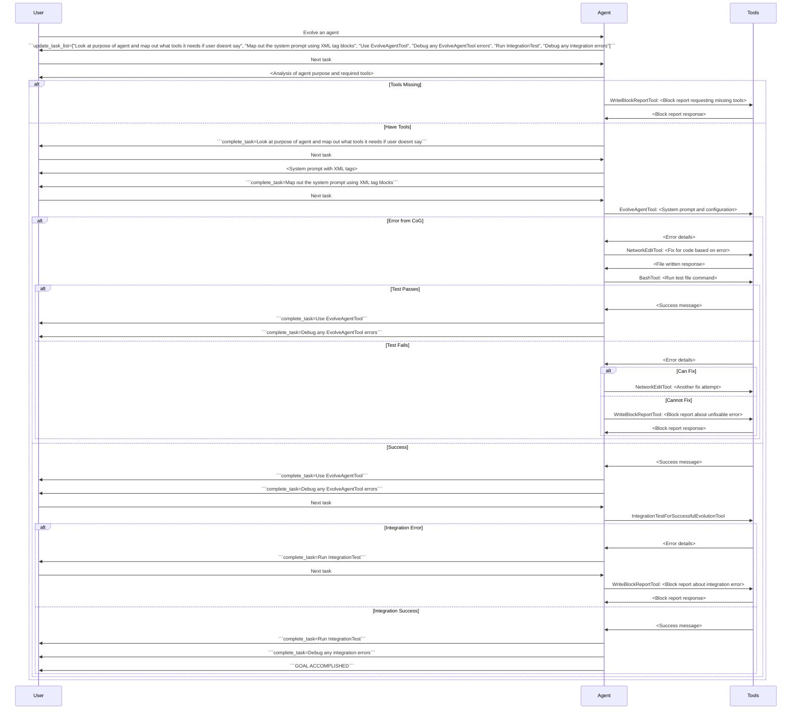

```mermaid
sequenceDiagram
    participant User
    participant Agent
    participant Tools

    User->>Agent: Evolve an agent
    Agent->>User: ```update_task_list=["Look at purpose of agent and map out what tools it needs if user doesnt say", "Map out the system prompt using XML tag blocks", "Use EvolveAgentTool", "Debug any EvolveAgentTool errors", "Run IntegrationTest", "Debug any integration errors"]```

    User->>Agent: Next task
    Agent->>User: <Analysis of agent purpose and required tools>
    alt Tools Missing
        Agent->>Tools: WriteBlockReportTool: <Block report requesting missing tools>
        Tools->>Agent: <Block report response>
    else Have Tools
        Agent->>User: ```complete_task=Look at purpose of agent and map out what tools it needs if user doesnt say```

        User->>Agent: Next task
        Agent->>User: <System prompt with XML tags>
        Agent->>User: ```complete_task=Map out the system prompt using XML tag blocks```

        User->>Agent: Next task
        Agent->>Tools: EvolveAgentTool: <System prompt and configuration>
        alt Error from CoG
            Tools->>Agent: <Error details>
            Agent->>Tools: NetworkEditTool: <Fix for code based on error>
            Tools->>Agent: <File written response>
            Agent->>Tools: BashTool: <Run test file command>
            alt Test Passes
                Tools->>Agent: <Success message>
                Agent->>User: ```complete_task=Use EvolveAgentTool```
                Agent->>User: ```complete_task=Debug any EvolveAgentTool errors```
            else Test Fails
                Tools->>Agent: <Error details>
                alt Can Fix
                    Agent->>Tools: NetworkEditTool: <Another fix attempt>
                    # ... continue fix/test cycle
                else Cannot Fix
                    Agent->>Tools: WriteBlockReportTool: <Block report about unfixable error>
                    Tools->>Agent: <Block report response>
                end
            end
        else Success
            Tools->>Agent: <Success message>
            Agent->>User: ```complete_task=Use EvolveAgentTool```
            Agent->>User: ```complete_task=Debug any EvolveAgentTool errors```


            User->>Agent: Next task
            Agent->>Tools: IntegrationTestForSuccessfulEvolutionTool
            alt Integration Error
                Tools->>Agent: <Error details>
                Agent->>User: ```complete_task=Run IntegrationTest```

                User->>Agent: Next task
                Agent->>Tools: WriteBlockReportTool: <Block report about integration error>
                Tools->>Agent: <Block report response>
            else Integration Success
                Tools->>Agent: <Success message>
                Agent->>User: ```complete_task=Run IntegrationTest```
                Agent->>User: ```complete_task=Debug any integration errors```
                Agent->>User: ```GOAL ACCOMPLISHED```
            end
        end
    end
```
