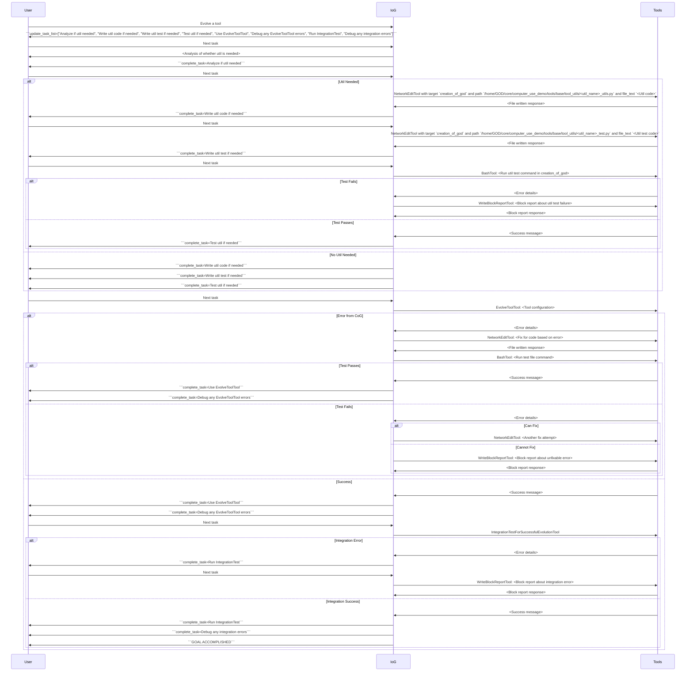

```mermaid
sequenceDiagram
    participant User
    participant IoG
    participant Tools

    User->>IoG: Evolve a tool
    IoG->>User: ```update_task_list=["Analyze if util needed", "Write util code if needed", "Write util test if needed", "Test util if needed", "Use EvolveToolTool", "Debug any EvolveToolTool errors", "Run IntegrationTest", "Debug any integration errors"]```

    User->>IoG: Next task
    IoG->>User: <Analysis of whether util is needed>
    IoG->>User: ```complete_task=Analyze if util needed```

    User->>IoG: Next task
    alt Util Needed
        IoG->>Tools: NetworkEditTool with target `creation_of_god` and path `/home/GOD/core/computer_use_demo/tools/base/tool_utils/<util_name>_utils.py` and file_text `<Util code>`
        Tools->>IoG: <File written response>
        IoG->>User: ```complete_task=Write util code if needed```

        User->>IoG: Next task
        IoG->>Tools: NetworkEditTool with target `creation_of_god` and path `/home/GOD/core/computer_use_demo/tools/base/tool_utils/<util_name>_test.py` and file_text `<Util test code>`
        Tools->>IoG: <File written response>
        IoG->>User: ```complete_task=Write util test if needed```

        User->>IoG: Next task
        IoG->>Tools: BashTool: <Run util test command in creation_of_god>
        alt Test Fails
            Tools->>IoG: <Error details>
            IoG->>Tools: WriteBlockReportTool: <Block report about util test failure>
            Tools->>IoG: <Block report response>
        else Test Passes
            Tools->>IoG: <Success message>
            IoG->>User: ```complete_task=Test util if needed```
        end
    else No Util Needed
        IoG->>User: ```complete_task=Write util code if needed```
        IoG->>User: ```complete_task=Write util test if needed```
        IoG->>User: ```complete_task=Test util if needed```
    end

    User->>IoG: Next task
    IoG->>Tools: EvolveToolTool: <Tool configuration>
    alt Error from CoG
        Tools->>IoG: <Error details>
        IoG->>Tools: NetworkEditTool: <Fix for code based on error>
        Tools->>IoG: <File written response>
        IoG->>Tools: BashTool: <Run test file command>
        alt Test Passes
            Tools->>IoG: <Success message>
            IoG->>User: ```complete_task=Use EvolveToolTool```
            IoG->>User: ```complete_task=Debug any EvolveToolTool errors```
        else Test Fails
            Tools->>IoG: <Error details>
            alt Can Fix
                IoG->>Tools: NetworkEditTool: <Another fix attempt>
                # ... continue fix/test cycle
            else Cannot Fix
                IoG->>Tools: WriteBlockReportTool: <Block report about unfixable error>
                Tools->>IoG: <Block report response>
            end
        end
    else Success
        Tools->>IoG: <Success message>
        IoG->>User: ```complete_task=Use EvolveToolTool```
        IoG->>User: ```complete_task=Debug any EvolveToolTool errors```


        User->>IoG: Next task
        IoG->>Tools: IntegrationTestForSuccessfulEvolutionTool
        alt Integration Error
            Tools->>IoG: <Error details>
            IoG->>User: ```complete_task=Run IntegrationTest```

            User->>IoG: Next task
            IoG->>Tools: WriteBlockReportTool: <Block report about integration error>
            Tools->>IoG: <Block report response>
        else Integration Success
            Tools->>IoG: <Success message>
            IoG->>User: ```complete_task=Run IntegrationTest```
            IoG->>User: ```complete_task=Debug any integration errors```
            IoG->>User: ```GOAL ACCOMPLISHED```
        end
    end
```
